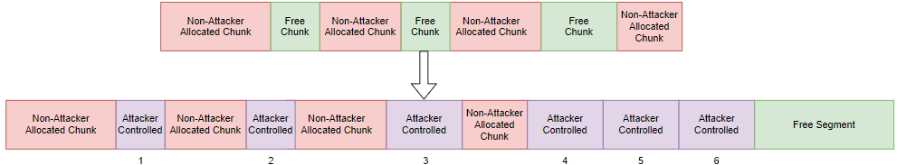

# Validate Heap Integrity
>[!NOTE]
> Originally based off notes from [llan-OuO](https://github.com/llan-OuO).
---
> Terminates a process when heap corruption is detected. - Microsoft


The *Validate Heap Integrity* exploit mitigation in Windows is a system-level mitigation mechanism that is enabled by default on most systems (Windows 11, and Windows Server). This mitigation aims to prevent the exploitation of application specific data which is stored on a heap from being exploited to gain control of the execution of a thread. The implementation of these defenses are a part of the Windows Heap Manager, not the application binary itself. The changes to the Windows Heap Manager not only validate the integrity of the objects allocated onto the heap, but additional restrictions and changes were implemented to ensure the Heap objects and the Heap itself remain in a consistent and valid un-modified state. There are two classes of mitigations applied on the Windows heap: Those that protect the metadata itself and those that provide non-determinism [2]. We will be focusing on those protections used to protect the metadata stored on the heap.
## Windows Heap Structure
> [!NOTE]
> Additional details can be found in the Writeup [Heap-Overflow-Example](https://github.com/DaintyJet/Heap-Overflow-Example).

The structure of a heap in the Windows operating system follows that of most modern systems. That is, when we make a call with the `malloc(...)` or the Windows-specific `HeapAlloc(...)` functions, we will be returned an address that points to data contained in a *heap chunk*. The allocation of a *heap chunk* depends on a number of factors, but it should be noted that the chunk we were allocated was either allocated as a whole to us, or was once a part of a larger chunk which has been fragmented to create a smaller series of *heap chunks* for our use. Generally a heap manager such as the one used in Windows will apply various strategies to limit the fragmentation of the heap - these strategies are often guided by *heuristics*.

The Windows heap manager is separated into a *Front-End* and a *Back-End*, We first interact with the Back-End allocator by default until our operations trigger the heuristics and we are switched to use the Front-End allocator. Specifically, once we make 18 or more allocations of the same size (*Less than 16kb each*) we will be switched over to the Front-End allocator which is commonly called a *Low Fragmentation Heap* (LFH) whose allocations are a part of a large heap chunk allocated to the Front-End by the Back-End allocator. This chunk is then made into a series of smaller blocks managed by the Front-End allocator, these smaller blocks are organized into *buckets* and those blocks in the bucket are not assigned in a linear fashion and their addresses may not be contiguous in nature so it is much harder to predict where or if there will be adjacent blocks allocated to our program. Exploits utilizing the Windows heap, therefore, try to avoid triggering the LFH as they want to reliably overflow or access an *adjacent chunk* to the one they control.

The metadata of a heap chunk is used by the heap manager during the normal management operations on the heap - one notable use is during a `free(...)` operation where adjacent chunks may be coalesced to reduce fragmentation. We are not particularly concerned with the contents of the metadata in the heap chunk, but we do need to keep in mind this header is stored on the heap at the head of it's associated data chunk.

> [!NOTE]
> Numerous historical attacks involved modifying the heap chunk's metadata to corrupt process information, such as the addresses stored in the global offset table when heap operations would be done on the corrupted chunk. Most of these attacks have been mitigated by protections discussed in later sections.

Below we can see an illustration of the Windows Heap's free list:


* `F-Link` (Flink): This is a pointer to the next entry on the free list. In the case this is a member of the *FreeLists*/*ListHints* object, this is a pointer to the first element on the free list [3].
* `B-Link` (Blink): This is a pointer to the previous entry on the free list. If this is a member of the *FreeLists*/*ListHints* object, this is used to determine if the LFH is active or should be activated, acting as a counter before activation and, once activated, will consist of a pointer to the `_HEAP_BUCKET` used in LFH, allocations.
* `Data`: The Chunk's data.

We can examine a `_HEAP_ENTRY` object that would be located on the heap using the command `dt _HEAP_ENTRY` in [WinDBG](https://learn.microsoft.com/en-us/windows-hardware/drivers/debugger/). In Windows 11 it has the following structure:

```
ntdll!_HEAP_ENTRY
   +0x000 UnpackedEntry    : _HEAP_UNPACKED_ENTRY
   +0x000 Size             : Uint2B
   +0x002 Flags            : UChar
   +0x003 SmallTagIndex    : UChar
   +0x000 SubSegmentCode   : Uint4B
   +0x004 PreviousSize     : Uint2B
   +0x006 SegmentOffset    : UChar
   +0x006 LFHFlags         : UChar
   +0x007 UnusedBytes      : UChar
   +0x000 ExtendedEntry    : _HEAP_EXTENDED_ENTRY
   +0x000 FunctionIndex    : Uint2B
   +0x002 ContextValue     : Uint2B
   +0x000 InterceptorValue : Uint4B
   +0x004 UnusedBytesLength : Uint2B
   +0x006 EntryOffset      : UChar
   +0x007 ExtendedBlockSignature : UChar
   +0x000 Code1            : Uint4B
   +0x004 Code2            : Uint2B
   +0x006 Code3            : UChar
   +0x007 Code4            : UChar
   +0x004 Code234          : Uint4B
   +0x000 AgregateCode     : Uint8B
```
> ![IMPORTANT]
> This structure is 8 bytes in size and is prepended to all data entries on the heap. This means in order to overwrite the data section of a heap chunk, this needs to be overwritten.
* `Size`: Size of the chunk in terms of the number of blocks, including the `_HEAP_ENTRY` that are required to store the data. 
* `Flags`: Flags used to denote the state of the chunk, examples include *Free* and *Busy*.
* `SmallTagIndex`: This stores the checksum of the heap entry, consisting of the XOR'ed value of the first three bytes of the `_HEAP_ENTRY` 
* `SubSegmentCode`: Contains information on the Sub-Section this may be a part of. 
* `PreviousSize`: Previous Size of Chunk.
* `SegmentOffset`: Contains Segment Offset.
* `LFHFlags`: Flags used to control the Low Fragmentation Heap. 
* `UnusedBytes`: Used to store unused bytes. Also used when LFH is activated.
* `FunctionIndex`: Contains management information used by the Windows heap manager. <!--  Supposedly, it contains a function pointer/Index so the manager can perform specific operations on the heap-->
* `ContextValue`: Contains management information used by the Windows heap manager.
* `InterceptorValue`: Contains management information used by the Windows heap manager. This is used for additional information and can be used for debugging purposes. 
* `UnusedBytesLength`: Length in terms of the number of blocks that are unused in the current allocation.
* `EntryOffset`: Offset to the Heap Entry.
* `ExtendedBlockSignature`: Byte indicating if the chunk is being managed by the LFH.

> [!NOTE]
> There exist some sites containing older [C Source Code](https://www.nirsoft.net/kernel_struct/vista/HEAP_ENTRY.html) of the Windows `_HEAP_ENTRY`, though they are older based on the WinDBG output they are still mostly accurate. You can explore additional heap structures discussed in [3].

This means we will have a Heap with the following (simplified) structure of entries:


> [!NOTE]
> The entries in the heap may or may not be adjacent. Additionally, they may not be arranged in a linear order if multiple allocations are made in a row if this is executing in a multithreaded process.
>
> If we are going to overflow a heap chunk to overwrite one that is adjacent to it, we will need to overflow that chunk's `_HEAP_ENTRY` structure, which contains the *checksum* that is in the *SmallTagIndex*.

## Attacker's Goal
In order to understand why these defenses are necessary, and why they have been implemented in this manner we will provide a quick reminder and overview of how heap overflows work, what the attackers control and some of the reasons an attacker may need to act the way they do.

### Heap Manipulation
The first thing an attacker is required to do, is induce the heap into a vulnerable state. This is commonly referred to as *heap massaging* or *heap grooming*, as most of the time our target heap is not going to be in a known state and the allocations are unlikely to be made in a deterministic manner. This is because if the LFH is triggered the allocated blocks from th buckets are not chosen in a linear manner as mentioned previously, and over the course of a processes lifetime the heap chunks are allocated and freed. Leading to a fragmented heap where free blocks are not necessarily adjacent to one another. This means the first step in an attack that exploits the heap, is taking the heap from an unknown state, to one that likely contains adjacent free chunks that can be overflowed.

This means, the attacker will generally preform a series of allocations in the backend heap allocator. This can be done to fill up the current heap segment and make the system allocate a new heap segment, or to fill the holes between allocated chunks in a segment of the heap.

For example, if we attempted to exploit a heap that is in a *bad* state, with pre-existing allocations from the process that we do not control we may not be able to overflow chunks an induce the behavior we would like. As we cannot predict what the chunk we are overflowing is used for, if it will be freed or even what it may contain. 


This is why you will see real exploits preform a number of allocations, this could be done by using a library in a specific manner, connecting to a server a number of times, or sending specially crafted messages. This is done to put the heap into a state where it is most-likely going to be possible for us to overflow a chunk we control for more reliable exploits - though this not always reliable [13].



> [!NOTE]
> We will be using the above image as a reference, for simplicity we will be assuming the heap allocations a filled from left to right in order as annotate. This may not be the case in a real-world scenario.

In this example, we perform a series of three allocations to fill the current *holes* in the heap. We may not need to fill all the holes but only those of the size we are requesting to make a new heap segment get allocated or to start breaking up a larger free block. For this example, after the first three allocations the next three are *adjacent* as they are being allocated from a large free block being segmented or are allocated in a new heap segment. 
### Heap Overflows
There are a number of possible attacks on a heap object, from overwriting data directly, preforming a use-after free exploit, or even just preforming overflows within a heap chunk (structured data) [13]. We are focusing on overflowing adjacent chunks to overwrite data, hence the previous subsection focusing on the layout of the heap and why we will be freeing one of those allocated chunks as part of the overflow in our example.

First we have preformed a series of allocation to put the heap into a state where we the  *attacker* control adjacent chunks.


The heap grows from a *low address* to a *high address*, and when we write to the heap chunk we are writing from a *low* to *high* address as well. This means when we preform the overflow the *deeper* chunk we are overwriting needs to already exist which is unlikely if we are allocating from a new segment or are fragmenting a large free chunk as the allocations will be from the start of the chunk rather than the middle or end. This is why we free a chunk we already control and preform an allocation of the *same* size, this is so we reuse the space from the recently freed chunk and can now overflow in the in-use chunk we control that is adjacent to it. This is all shown in the example image below.


## Windows Heap Corruption Mitigation Strategies
Windows has made a number of modifications to the `_HEAP_CHUNK` structure to enable the Windows Operating System to prevent and detect when entries on the heap have been corrupted. Additionally, Windows has implemented some limitations to possible operations on the heap.

> [!IMPORTANT]
> The following lists are based on two Windows security blog releases [1] and [2]

The first modifications we will discuss are the behavioral changes made to Windows in order to prevent the heap from being placed into an invalid state.
* `Heap Handle Freeing`: Starting in Windows 8, the handle to the heap structure can no longer be freed from memory. This is to prevent attacks where the attacker would free the heap handle, and would re-allocate this memory to a structure they controlled in order to corrupt the internal metadata and gain control over the executable.
* `Busy Status Validation`: Starting in Windows 8, the heap manager will verify that a block is *not busy* (un-allocated) before allocating it. If the block is busy the process will be terminated. This is to prevent attacks where an in-use block is corrupted in order to gain control over the flow of execution. For example the attacker could replace a C++ object and it's function pointers or virtual function pointers.
* `LFH Allocation Behavior`: Starting in Windows 8, the allocation order of the *Low Fragmentation Heap* has been randomized. It no longer allocates blocks linearly, so it is difficult to guarantee that blocks will be allocated adjacent to one another, allowing overflows and overwrites. The randomization is *specific and limited* to the LFH subsegments.
* `Exception Handling`: Starting in Windows 8 they removed a *Catch-All* exception handler in heap management functions. These *Catch-All* exception blocks made it so certain exceptions raised during the execution of heap operations would not be fatal to the program and it would recover and continue execution. This made it so attackers would have multiple attempts at exploiting the Windows heap functionality.
* `HEAP Base Address`: Starting in Windows Vista and Server 2008, the base address of a heap can be randomized if the executable is marked as ASLR compatible.
* `Action on Heap Corruption`: Starting in Windows Vista and Server 2008, when a heap data structure is corrupted in any way and this is detected, the process will be terminated.
* `Allocation Algorithms`: Starting in Windows Vista and Server 2008, the algorithms used to preform heap allocations would shift depending on the allocation type and policy associated. This would make allocations less deterministic due to the variations in algorithms used making exploitation more difficult.

In addition to behavioral changes, Windows also performs a number of modifications to the data structures and heap functions in order to detect when a heap data structure has been corrupted.
* `Removal of Data Structures`: Starting in Windows Vista and Server 2008, commonly targeted data structures such as the *Lookaside List* have been removed or replaced.
* `Heap Cookie`: Starting in Windows XP and Server 2003, each heap entry (*_HEAP_ENTRY*) header had an 8-bit random value that would be validated when the heap entry is freed.
  * `Expanded Validation`: Starting in Windows Vista and Server 2008, the aforementioned heap cookie would be validated during most heap operations on the entry rather than just when it was freed.
* `Metadata Randomization`: Starting in Windows Vista and Server 2008, the header of each heap entry (*_HEAP_ENTRY*) is XOR'ed with a random value so during each heap operation the integrity of the header can be confirmed. 
* `Function Pointer Encoding`: Starting in Windows Vista and Server 2008, Any function pointer contained within a heap data structure would have it's address encoded to later be decoded when used. The original value would be encoded with a *random value* to prevent the original value from being replaced.
  * `CommitRoutine Global Key`: Starting in Windows 8, the key-value used to encode the *CommitRoutine* function pointer was moved outside of the heap handle data structure.
* `Unlinking`: Starting in Windows XP and Server 2003, The list entry in an already freed heap chunk is verified to be a valid entry in the doubly linked list. This is because when we free an object allocated on the heap it will be placed back onto the free list, and we may need to coalesce adjacent free chunks *unlinking* them from the free list. Attackers would use this behavior to perform arbitrary writes.
* `Extended Block Header Validation`: Starting in Windows 8, the Extended Block Header, which contains additional metadata associated with the heap chunk, would be validated with additional checks. Before this, an attacker would be able to make the heap manager free additional in-use blocks by modifying the exiting header to think it had an extended block header even if it did not and applying the appropriate values.
* `LFH Structure Member Encoding`: Starting in Windows 8, the *FirstAllocationOffset* and *BlockStride* members used by the *Low Fragmentation Heap* are encoded. This is because attackers would be able to modify them to make the LFH return an address outside of the region of memory the LFH had been allocated on the heap. This allowed attackers to potentially corrupt other structures and data located on the heap.
* `Guard Pages`: Starting in Windows 8, *guard pages* which cannot be written to or read from are allocated onto the heap between various regions. This partitioning of the heap prevents overflows from reading or writing to regions beyond the *guard page*. **Ideally** each and every allocation would be wrapped in guard pages however this is not feasible in a real system at this time. Below are the summarized cases where a guard page is deployed.
  * `Large Allocations`: Allocations of a large enough size will have a trailing guard page allocated in memory. This will be done for allocations larger than 512 Kb on a 32-bit system or 1 Mb on a 64-bit system.
  * `Heap Segments`: A trailing guard page will be allocated for all heap segments.
  * `Maximally Sized Subsegments`: A heap segment may contain one or more subsegments used by the LFH, after a threshold is triggered *maximally sized subsegments* will be allocated to the LFH containing the maximum number of blocks for a given size. Each *maximally sized subsegment* will have a trailing guard page allocated.


## Windows Heap Protection Flags
This section contains various flags that can be applied to a Windows heap structure, they are discussed in the [Global Flag Reference](https://learn.microsoft.com/en-us/windows-hardware/drivers/debugger/global-flag-reference) documentation. We will briefly discuss the flags used to control the validation of heap chunks; we will not focus on all of the flags in this reference document as most do not pertain to the heap and some are used more for debugging like the [Enable Heap Tagging](https://learn.microsoft.com/en-us/windows-hardware/drivers/debugger/enable-heap-tagging?source=recommendations) flag. You can modify the heap flags on a program using the *Global Flags Editor*, [GFlags](https://learn.microsoft.com/en-us/windows-hardware/drivers/debugger/gflags-commands) program.

* [`FLG_HEAP_ENABLE_FREE_CHECK`](https://learn.microsoft.com/en-us/windows-hardware/drivers/debugger/enable-heap-free-checking?source=recommendations): When this flag is enabled, the program will validate each heap allocation when that allocation is freed. This is enabled by default, and can be modified using the *GFlags* program with the `/p /disabled` flags pared with the *FLG_HEAP_ENABLE_FREE_CHECK* value.
* [`FLG_HEAP_ENABLE_TAIL_CHECK`](https://learn.microsoft.com/en-us/windows-hardware/drivers/debugger/enable-heap-tail-checking): As with the previous *FLG_HEAP_ENABLE_FREE_CHECK* flag this is used to control the verification of heap chunks when they are freed. When this is enabled a short pattern is added to the end of the heap chunk when it is allocated by the heap manager. This value will then be verified when the heap chunk is freed, and if it has been modified an overflow occurred.
* [`FLG_HEAP_VALIDATE_ALL`](https://learn.microsoft.com/en-us/windows-hardware/drivers/debugger/enable-heap-validation-on-call?source=recommendations): When this flag is enabled, the entire heap, that is all of the internal heap structures and chunks are validated *for each heap management function call*. Microsoft suggests that this flag not be used unless you are debugging a program that suffers from random corruptions as in a production environment this incurs significant overhead. If you need to validate a heap, Microsoft suggests the [`HeapValidate`](https://learn.microsoft.com/en-us/windows/win32/api/heapapi/nf-heapapi-heapvalidate) function.
* [`FLG_HEAP_VALIDATE_PARAMETERS`](https://learn.microsoft.com/en-us/windows-hardware/drivers/debugger/enable-heap-parameter-checking?source=recommendations): Per Microsoft when this flag is enabled "selected" aspects of the heap are verified. They do not have clear documentation on this flag.
* [`FLG_HEAP_PAGE_ALLOCS`](https://learn.microsoft.com/en-us/windows-hardware/drivers/debugger/enable-page-heap?source=recommendations): When this flag is enabled, certain measures will be implemented to validate the integrity of a heap entry when allocation or free operations are preformed. There are two options, the *Full Page Heap Verification* option controls the placement of "reserved virtual memory" like guard pages at the end of each allocation preformed, and the *Standard Page Heap Verification* which uses the strategy discussed with the *FLG_HEAP_ENABLE_TAIL_CHECK* flag to validate chunks when they are freed.


## Windows Validate Heap Integrity Option
This setting in the Windows Operating System controls some of the strategies discussed previously in the [Windows Heap Corruption Mitigation Strategies](#windows-heap-corruption-mitigations-strategies) section. It should be noted that it **does not** control all of the protections Windows implements! The majority of the aforementioned protections are enabled by default and are not immediately available to the user for configuration. Below are the mitigation controller by the *Validate Heap Integrity* option as described in [4] the *Exploit Protection Reference* from Windows.

> [!NOTE]
> One notable statement in the Exploit Protection Reference is "The validate heap integrity mitigation increases the protection level of heap mitigation in Windows, by causing the application to terminate if a heap corruption is detected." [4]. However, it should be noted even if you have this disabled in Windows 11, if one of the other mitigation techniques detects a corruption in the heap, such as when freeing an object that had its heap metadata corrupted, the program will be terminated.


* `Heap Handle Freeing`: Starting in Windows 8, the handle to the heap structure can no longer be freed from memory. This is to prevent attacks where the attacker would free the heap handle, and would re-allocate this memory to a structure they controlled to corrupt the internal metadata to gain control over the executable.
* `Extended Block Header Validation`: Starting in Windows 8, the Extended Block Header which contains additional metadata associated with the heap chunk would be validated with with additional checks. Before this attacker would be able to make the heap manager free additional in-use blocks by modifying the exiting header to think it had an extended block header even if it did not and applying the appropriate values.
* `Busy Status Validation`: Starting in Windows 8, the heap manager will verify a block is not busy before allocating it. If the block is busy the process will be terminated. This is to prevent attacks where an in-use block is corrupted in order to gain control over the flow of execution. For example, the attacker could replace a C++ object and its function pointers or virtual function pointers.
* `Guard Pages`: Starting in Windows 8, *guard pages* which cannot be written to or read from are allocated onto the heap between various regions. This partitioning on the heap prevents overflows from reading or writing to regions beyond the *guard page*. **Ideally** each and every allocation would be wrapped in guard pages however this is not feasible in a real system at this time. Below are the summarized cases where a guard page is used.
  * `Large Allocations`: Allocations of a large enough size will have a trailing guard page allocated in memory. This will be done for allocations larger than 512 Kb on a 32-bit system or 1 Mb on a 64-bit system.
  * `Heap Segments`: A trailing guard page will be allocated for all heap segments.
  * `Maximally Sized Subsegments`: A heap segment may contain one or more subsegments used by the LFH, after a threshold is triggered *maximally sized subsegments* will be allocated to the LFH containing the maximum number of blocks for a given size. Each *maximally sized subsegment* will have a trailing guard page allocated.


> [!IMPORTANT]
> Based on current experiences in Windows 11, it appears as though a heap block is always validated when attempting to free the allocation. As stated in the next section [Windows Validate Heap Integrity Option](#windows-validate-heap-integrity-option), the *Validate Heap Integrity* option does not seem to control all of the discussed mitigation strategies. Additionally, it is not entirely clear based on the reference if it contains all the strategies it does control as they say "The mitigations include", which means they may not be listing all the techniques the *Validate Heap Integrity* option controls.
## Modifying Heap Validation Protections
As heap validation is a system-wide setting, and does pose much risk to existing binaries if enabled as it affects the heap manager which is opaque to the user-space programs this does not contain the same opt-in or opt-out options as ASLR or CFG. We can enable or disable heap validation using with Windows Security Settings as shown below.

> [!NOTE]
> Per the Exploit Protection Reference [4], the programs most at-risk of having fatal errors and compatibility issues when the *Validate Heap Integrity* mitigation is enabled at those compiled for a Windows-XP system. Though Microsoft says, these issues are rare.


1. Open Windows Settings.

    

2. Open the Security Settings.

    

3. Open the Security Settings and navigate to `App & Browser Control`

    

4. Open The `Exploit Protection` page and scroll down till you find the *Validate Heap Integrity* option.

    

5. Modify the setting and restart the system.

    

## Heap Exploration: Standalone Program
This section will use a standalone program similar to the one used in the Writeup [Heap-Overflow-Example](https://github.com/DaintyJet/Heap-Overflow-Example), but it has been modified to be purely `C` rather than a `C++` program. Additionally this has been modified to be a Visual Studio Project. Although we will primarily be running the executable as a standalone program or attached to a debugger like [WinDBG](https://learn.microsoft.com/en-us/windows-hardware/drivers/debugger/), you can also use [Immunity Debugger](https://www.immunityinc.com/products/debugger/). However, the resources for using WinDBG are more easily accessible compared to some of the more limited [resources for Immunity Debugger](https://www.immunityinc.com/downloads/IntelligentDebugging.pdf).


We will first examine the behavior of the standalone program when *Validate Heap Integrity* has been **disabled** on the system. This should give us a baseline in terms of expected behavior from a executable.

> [!IMPORTANT]
> Running the Executable directly that is opening the folder the compiled EXE file is in and clicking on it or running it from the command line, and not using the *run* button in Visual Studio has lead to more reliable results.
>
> If you continue to not see results, try using a different method to run the executable.

1. Disable *Validate Heap Integrity* as shown in previous section [Modifying Heap Validation Protections](#modifying-heap-validation-protections).
2. Open the [Heap-Standalone](./SRC/Heap-Standalone/Heap-Standalone.sln) Visual Studio Project.
3. Open the `Project` -> `Properties` window and examine the various settings that have been modified. We have disabled some but not all of the security flags that would increase the security of this program, though they should not affect the heap overflow in the first place. This is to showcase that heap overflows bypass most of the *stack-based* protections!

    

4. Observe the section of code performing the initial set of allocations on the heap.

    ```c
    for (i = 0; i < ALLOC_COUNT; i++) {
        hChunk = HeapAlloc(defaultHeap, 0, CHUNK_SIZE);
        memset(hChunk, 'A', CHUNK_SIZE);
        allocations[i] = hChunk;
        printf("[%d] Heap chunk in backend : 0x%08x\n", i, hChunk);
    }
    ```
    * Here we are preforming `ALLOC_COUNT` allocations of the size `CHUNK_SIZE`; the current configuration means we have 10 allocations of the size 400 (Bytes). You can think of each allocations using `HeapAlloc` equivalent to the same `malloc` call as it will be placed on the same *Default Heap* of the process.
    * Each of these chunks is filled with a series of `A`s. This way we can identify them on the stack more easily.
5. Observe where an allocation is freed.
    ```c
    HeapFree(defaultHeap, HEAP_NO_SERIALIZE, allocations[6]);
    ```
    * We can see the 6th allocation is freed out of the 10 previous allocations. We will have the following heap state where we can overflow the previous chunk in order to overwrite the object that has been placed in an adjacent chunk. Additional information on this is included in the [Heap-Overflow-Example](https://github.com/DaintyJet/Heap-Overflow-Example) writeup.

        

6. Observe where the additional objects (function pointer arrays) are allocated onto the heap.
    ```c
    // Various Heap Allocations
    for (int i = 0; i < ALLOC_COUNT; ++i) {
        v_n =  malloc(sizeof(functionpointer) * allocSize);
        fill_array(v_n, obj, allocSize);
        v_allocs[i] = v_n; 
        printf("vector alloc %d: 0x%08x\n", i, v_n);
    }
    ```
    * As our allocSize is set to 40, we will need a 320-byte chunk on the heap for each of our allocations to succeed, which means one of allocations will fit onto the heap in the region of the previously freed chunk which was 400 bytes.
    * In this case the first allocation is the one which will most likely be placed into the hole we previously created in the heap.
    * Each array is filled with pointers to the `nicecode` which is stored in the `obj` pointer using the `fill_array` utility function declared elsewhere.
7. Observe where the Heap Overflow occurs.
    ```c
    char evilString[500];
    sprintf(evilString, <OVERFLOW STRING>, SIZE);
    memcpy(allocations[5], evilString, sizeof(evilString));
    ```
    * We first create the string we will overflow the heap chunk with.
    * We then copy that into the heap chunk at `allocations[5]` which should be adjacent to the `v1` functionpointer array which was allocated into the chunk that was made available when `allocations[6]` we freed.
8. Compile the Project. You can use one of the options in *Build* dropdown as shown below or the `Ctl + B` keybind.

    

9. Run the Project a few times. This should most of the time, produce the following output. Occasionally the program will fail due to corrupting internal heap structures.

    https://github.com/user-attachments/assets/e84c466b-536b-40c7-bad5-1fdbb3d0c617

    * Still Image:

        

10. **Enable** *Validate Heap Integrity* as shown in previous section [Modifying Heap Validation Protections](#modifying-heap-validation-protections).
11. Compile the Project. You can use one of the options in *Build* dropdown as shown below or the `Ctl + B` keybind.

    

12. Run the Project a few times. This continues to work...

    

This behavior may seem odd at first, as we have enabled the *Validate Heap Integrity* configuration for the system, and there are no apparent flags to control this on a per-process basis during the building of our project (There are options like Microsoft Defender Configurations for enterprise systems that can achieve this granular approach). However, this is behaving as expected for the following reasons:


Guard Pages are only inserted after large allocations or between heap segments, as discussed in [Windows Heap Corruption Mitigation Strategies](#windows-heap-corruption-mitigation-strategies). Windows does not insert guard pages for each heap allocation primarily due to performance concerns. Generally, each memory page will be 4-Kilobytes, though you may find systems with 2-Kilobyte or 8-Kilobyte pages. Due to the methods used to handle virtual memory, the granularity of protections we can apply is on a per-page basis. This means if we wanted to allocate a non-writable and non-readable region of memory between each heap object to prevent overflows from successfully corrupting data, we would need to allocate 1 page for the heap object and an additional page that is non-readable and non-writable. This means, rather than partitioning a page to support many heap allocations, we could be wasting a large amount of memory; for example, if we were to allocate a single `char` that is one byte on the heap, with this strategy we would be waisting 99% of the page the heap chunk for the `char` is located in, and we would be allocating 8-Kilobytes (2 pages) for a single `char`. 

Validation occurs when we perform operations on a heap chunk, not when we are performing operations on the data contained within a heap chunk. This has to do with the C compiler and how Windows can apply this protection to all processes regardless of when their executable was compiled. First, let's look at the assembly of the function call using an address stored on the heap:

1. Set a breakpoint at the first function call, and click run.

    

2. Right-click the function call and select *Go To Disassembly*

    

3. Look at the assembly for the function call it should look something like the code shown below.
    ```
    00ED1C90  mov         eax,dword ptr [arg]
    00ED1C93  push        eax
    00ED1C94  mov         ecx,4
    00ED1C99  imul        edx,ecx,0
    00ED1C9C  mov         eax,4
    00ED1CA1  imul        ecx,eax,0
    00ED1CA4  mov         edx,dword ptr v_allocs[edx]
    00ED1CA8  mov         eax,dword ptr [edx+ecx]
    00ED1CAB  call        eax
    00ED1CAD  add         esp,4
    ```

We can see we start off by loading the argument *arg* onto the stack with a `mov eax,dword ptr [arg]` followed by a `push eax`, after this we calculate the offsets required to access the appropriate array of function pointers. Since the *v_allocs* array is also an array of pointer, and we are generating a 32-bit executable the pointer values are 4-bytes in size, and we first calculate the offset in *v_allocs* with `mov ecx,4` to load the size of the pointer and `imul edx,ecx,0` to calculate the offset (0). We do the same to calculate the offset within the array of function pointers, but instead of saving the result to `edx` as done previously we save it to `ecx`. Then we load the address of the function into `eax` to preform the function call, first we load the address of the array of function pointers into `edx` with the instruction `mov edx,dword ptr v_allocs[edx]` then we offset this with the offset we calculated earlier to determine the function in the array we are calling with the instruction `mov eax,dword ptr [edx+ecx]`. Finally we call the target function who's address is stored in `eax` with the instruction `call eax` and clean up the argument on the stack when it returns with `add esp,4`. **Notice** how at no point do we perform a call to a function that can validate the integrity of the heap! We preform a function call as we would for any other function pointer or external function, this is because the compiler does not track allocations that were preformed by `malloc(...)`, `HeapAlloc(...)` or an alternative function to preform memory allocations. This means the compiler also does not apply any special checks to call functions used to validate the integrity of a heap chunk before we use the information contained within. **Additionally** the current checks implemented to validate the integrity of the heap are preformed in the memory management functions provided by Windows, this probably for a number of reasons. The first and most apparent is operations on heap objects are critical and require the heap data structures and metadata to be valid and not under the control of an attacker. The other reason is this approach only modifies the memory management functions, and as long as a program utilizes a *DLL` and is dynamically linked, then it will benefit from the additional validation checks when heap operations are performed regardless of when they were compiled.

Finally, this is an idealized exploit... There are many heap exploits that have been defeated by the Validate Heap Integrity option and all of the additional mitigation Windows has implemented over the years. From attacks like exploiting a [Vectored Exception Handler](https://learn.microsoft.com/en-us/windows/win32/debug/vectored-exception-handling) stored on the heap, modifying heap chunk's metadata while it is on the free list to gain control over the flow of execution, double free attacks and many others!


> [!NOTE]
> As this exploit overwrites a function pointer, if we enable the Control Flow Guard mitigation discussed previously in [VChat_CFG](https://github.com/DaintyJet/VChat_CFG), then this exploit would be mitigated.

## Heap Exploitation: Heap Standalone Large Alloc
In this section we will be using another slightly modified program [Heap-Standalone-Large-Alloc](./SRC/Heap-Standalone-Large-Alloc/Heap-Standalone-Large-Alloc.sln), with this program we will explore how large allocations on the heap, in this case with a 32-bit program that means allocations larger than 512-Kilobytes are handled and what protections are provided. Namely we will be examining the *Guard Pages* inserted by the Windows heap manger when performing these allocations. The code was simplified for this demonstration, omitting the freeing and reallocation of data and instead attempts to directly overflow adjacent blocks.


> [!IMPORTANT]
> When viewing allocations on the Heap we will be able to see the size of the region they occupy. However, there may appear to be a difference between the requested size and the region actually allocated by the request. This is primarily due to memory alignment criteria, be that within the heap or on a page-sized basis for virtual memory.
>
> Additionally, if we view page sizes, a 4-kB page is 4096 bytes, not 4000 bytes. This is because they are calculated in terms of Kibibytes (1024 bits) rather than Kilobytes (1000 bits), which we as consumers generally use.


1. Open the [Heap-Standalone-Large-Alloc](./SRC/Heap-Standalone-Large-Alloc/Heap-Standalone-Large-Alloc.sln) and compile the executable.
2. Observe the section performing the allocations on the heap.
    ```c
    for (int i = 0; i < ALLOC_COUNT; i++) {
        v_n = HeapAlloc(defaultHeap, NULL, sizeof(functionpointer) * allocSize);
        fill_array(v_n, obj, allocSize);
        allocations[i] = v_n;
        printf("[%d] Heap chunk addr: 0x%08x\n", i, v_n);
    }
    ```
   * We are creating the arrays for the function pointers directly, in this case we are doing `sizeof(functionpointer)` which should resolve, to 4 (bytes) and multiplying it with `allocsize` which is `0x249F0` around 588-Kilobytes.
   * We are using the local utility function `fill_array` to fill the array with pointer to the local function `nicecode` stored in the function pointer `obj`.

3. Examine where we calculate to offset. We do this because the gaps between the large allocations vary, this is likely due to the fact `HeapAlloc(...)` or `malloc(...)` with these large allocations is most likely going preform the allocations directly in virtual memory rather than partitioning a large heap segment. This combined with heap and page alignment requirements is the most likely cause for the variation in distances.
    ```c
        offset = (unsigned long)(allocations[6]) - (unsigned long)(allocations[5]);
    ```

4. Finally we can look at the place where the overflow occurs, in this case we just want to try and overflow into a chunk to see if this is possible. So we just use a for loop to try writing up to that location!
    ```c
    for (unsigned long i = 0; i < offset; ++i) {
        ((char*)(allocations[5]))[i] = 'B';
    }
    ```
   * Here we use a for loop, you could also use `memset(...)`.

5. Open WinDBG and launch our executable.

    

6. For simplicity, open the source file so you can easily set breakpoints and see where in the code's execution we are.

    

7. Set a breakpoint before the `pause(...)` this way we can examine the stack without the program blocking the debugger. When we use the `pause()` function the process is still considered in a *busy* state.

    

8. Open the *Memory View* window

    

9. Observe the heap chunk.

    

10. Use the `!address <address>` command examine the [characteristics](https://learn.microsoft.com/en-us/windows/win32/api/winnt/ns-winnt-memory_basic_information) of our heap chunk. Replace `<address>` with the value returned by a heap chunk, in this case we would chose the one we were writing the `B`s to so heap chunk 5's address. 

    

   * `Base Address`: Starting address of region of memory - pages of memory.
   * `End Address`: This is the address where the current set of pages ends.
   * `Region Size`: Size of the region (kB is Kibibytes - 1024 bytes)
   * `Region State`: State of the pages in this region of memory
     * `Committed`: Memory region that has been allocated and is present in physical storage - RAM memory or on disk represented in the paging memory.
     * `Reserved`: Reserved region of memory, not present in physical memory.
     * `Free`: Free page, not accessible.
   * `Protect`: Which [protections](https://learn.microsoft.com/en-us/windows/win32/memory/memory-protection-constants) are placed on this region of Virtual Memory.
   * `Type`: The type of memory pages in the region
     * `Image`: Mapped into view an image section.
     * `Mapped`: Mapped into view of a section.
     * `Private`: Private memory regions not mapped into view of other processes.
11. Use the command `!vprot <address>` to print the protection characteristics of the virtual memory region. Again we would use the address of the 5'th heap chunk.

    

12. Click *Run*, and in the terminal provide input to unpause the program.

    

    * Notice the error message!
13. Now use the *End Address* value from the previous `!address <HeapChunk>` command's output to view the end of the heap chunk in the *Memory View*.

    

    * Notice how the `B`s abruptly stop!
12. Use the `!address <address>` command to view the characteristics of the *Ending Address* of the heap chunk.

    

    * There are a few important things to notice.
      * `Region Size`: Notice how this is on 4-kB. As this is the size of a page on my systems this is just 1 page.
      * `Region State`: Notice how this is *Reserved* this means it is not loaded in physical. memory. If we try to access or modify this region an exception will be thrown.
      * `Protect`: Is not present due to not being *Committed*.
13. Using the `!vprot <address>` print out the protection characteristics of the *Ending Address* region of the heap chunk.

    

    * Notice that there are protections for the page, but since the region is not *Committed* they are not particularly relevant since attempting to access or modify this region will lead to a crash.
14. Use the `!address <address>` command to view the characteristics of the next *Ending Address* after the 4-kB Region following our heap Chunk.

    

    * Notice a few things
    * `Usage`: This region is Free, not committed or reserved.
    * `Region Size`: This is not a single page, and if we do this multiple times we will notice it changes and is irregular.


16. Use the Heap commands shown in the *More Info* section when you ran the `!address <address>` command. Try it on overflowed `!heap -s -h <address>`
    1) First Locate the command used to print the information on the owning heap.

        

    2) Use the first command (`!heap -s -h <address>`) to examine the state of the heap that owns this block of memory, as we used `HeapAlloc(...)` with the default heap's handle the address provided refers to the default heap. If we had allocated this on a heap we created at runtime using `HeapCreate(...)` this would not refer to the default heap, and instead contain an address referring to the one we created.

        

        * `Flags`: Notice the [HEAP_TAIL_CHECKING_ENABLED](https://learn.microsoft.com/en-us/windows-hardware/drivers/debugger/enable-heap-tail-checking) and [HEAP_FREE_CHECKING_ENABLED](https://learn.microsoft.com/en-us/windows-hardware/drivers/debugger/enable-heap-free-checking) flags. Both are used to enable the verification of heap chunks when they are freed.
        * `Virtual blocks`: This helps to confirms that the large allocations are allocated separately in Virtual-Memory directly, we can also see this from the summery of heap allocations in the table that was also displayed.
    3) Use the second command (`!heap -x <address>`) to display information on the specific heap chunk we used the `!address` command on.

        

Repeat this with *Validate Heap Integrity Disabled* (If you already had it disabled, repeat it with *Validate Heap Integrity Enabled*). Do you see any differences?

> [!NOTE]
> You can use `wt -r` on the `call` instruction for `HeapAlloc()` in WinDBG to view the trace of the *HEapAlloc* function call.
>
>   Below is an example trace from this program
>    ```
>    19     0 [  0] ntdll!RtlAllocateHeap
>    59     0 [  1]   ntdll!RtlpAllocateHeapInternal
>    44     0 [  2]     ntdll!RtlpAllocateHeap
>     3     0 [  3]       ntdll!RtlDebugAllocateHeap
>    21     0 [  4]         ntdll!_SEH_prolog4
>    17    21 [  3]       ntdll!RtlDebugAllocateHeap
>    13     0 [  4]         ntdll!RtlpCheckHeapSignature
>    45    34 [  3]       ntdll!RtlDebugAllocateHeap
>    16     0 [  4]         ntdll!RtlEnterCriticalSection
>    53    50 [  3]       ntdll!RtlDebugAllocateHeap
>    14     0 [  4]         ntdll!RtlpValidateHeap
>    16     0 [  5]           ntdll!RtlpValidateHeapHeaders
>    29    16 [  4]         ntdll!RtlpValidateHeap
>    57    95 [  3]       ntdll!RtlDebugAllocateHeap
>    18     0 [  4]         ntdll!RtlAllocateHeap
>    59     0 [  5]           ntdll!RtlpAllocateHeapInternal
>    84     0 [  6]             ntdll!RtlpAllocateHeap
>    28     0 [  7]               ntdll!RtlpHpHeapCheckCommitLimit
>    87    28 [  6]             ntdll!RtlpAllocateHeap
>    11     0 [  7]               ntdll!RtlpHeapGenerateRandomValue32
>    14     0 [  8]                 ntdll!RtlRandomEx
>    13     0 [  9]                   ntdll!RtlRunOnceExecuteOnce
>    33     0 [ 10]                     ntdll!RtlRunOnceBeginInitialize
>    25    33 [  9]                   ntdll!RtlRunOnceExecuteOnce
>    72    58 [  8]                 ntdll!RtlRandomEx
>    17   130 [  7]               ntdll!RtlpHeapGenerateRandomValue32
>    96   175 [  6]             ntdll!RtlpAllocateHeap
>    17     0 [  7]               ntdll!RtlpHpAllocVirtBlockCommitFirst
>    14     0 [  8]                 ntdll!RtlpGetHeapProtection
>    15     0 [  9]                   ntdll!RtlpHpHeapValidateProtection
>    16    15 [  8]                 ntdll!RtlpGetHeapProtection
>    26    31 [  7]               ntdll!RtlpHpAllocVirtBlockCommitFirst
>        3     0 [  8]                 ntdll!NtAllocateVirtualMemory
>        1     0 [  9]                   ntdll!Wow64SystemServiceCall
>        1     0 [  9]                   0x77a87000
>    ```
>
> We can see this will call `RtlpHpAllocVirtBlockCommitFirst` which will then call `NtAllocateVirtualMemory` to allocate virtual memory for these large allocations [5].

## Heap Exploitation: Heap Standalone, Validations and Free
Finally we will examine the behavior of the Windows `ValidateHeap(...)` function that can be used to trigger the verification of the entire heap or a specific chunk. Additionally we will examine the behavior of the program when we are using `HeapFree(...)` or `free(...)` to release various chunks we have allocated after the overflow has occurred. This program is a slightly modified version of the first [Heap-Standalone](./SRC/Heap-Standalone/Heap-Standalone.sln) executable we first examined.

> [!NOTE]
> There is a flag that can be used on the heap [HEAP_VALIDATE_ALL](https://learn.microsoft.com/en-us/windows-hardware/drivers/debugger/enable-heap-validation-on-call) that will make the heap functions validate the entire heap whenever a heap management function is called. It's use in general-use programs and production environments is not suggested due to performance concerns.

### Validating The Entire Heap
1. Disable *Validate Heap Integrity* as shown in previous section [Modifying Heap Validation Protections](#modifying-heap-validation-protections).
2. Open the [Heap-Standalone-Validation](./SRC/Heap-Standalone-Validation/Heap-Standalone-Validation.sln) Visual Studio Project.
3. Ensure all the following preprocessor definitions are commented out except for the **HEAPVALIDATE_ALL**, below is what you should have.
    ```
    // Define Controls
    //#define FREE
    //#define HEAPVALIDATE_CHUNK
    //#define HEAP_CHUNK 1

    #define HEAPVALIDATE_ALL
    #define VALLOC_CHECK 1
    ```
    * This means the code to validate the entire heap will be generated as a call to the `HeapValidate(...)` function.
4. Build and run the project. Observe the output, notice the error code `-1073740940` this is the returned [error code](https://learn.microsoft.com/en-us/openspecs/windows_protocols/ms-erref/596a1078-e883-4972-9bbc-49e60bebca55#:~:text=a%20stack%20switch.-,0xC0000374,-STATUS_HEAP_CORRUPTION) we see when it has been detected that the integrity of the process's heap has been breached.

    

5. To confirm this, we can try executing the code in the Visual Studio Debugger.

    

6. If we attach this program to WinDBG and use the `wt` command to trace the execution of the call to `ValidateHeap(...)` we can observe many calls it makes that culminate in an exception being raised.

    ```
    062  2580 [  9]                   ntdll!_output_l
    3     0 [ 10]                     ntdll!__security_check_cookie
    3064  2583 [  9]                   ntdll!_output_l
    43  5647 [  8]                 ntdll!_vsnprintf_l
    12  5690 [  7]               ntdll!_vsnprintf
    397  5774 [  6]             ntdll!vDbgPrintExWithPrefixInternal
    5     0 [  7]               ntdll!RtlRaiseException
    10     0 [  8]                 ntdll!RtlCaptureContext
    17     0 [  8]                 ntdll!RtlpCaptureContext
    15    27 [  7]               ntdll!RtlRaiseException
    3     0 [  8]                 ntdll!NtRaiseException
    1     0 [  9]                   ntdll!Wow64SystemServiceCall
    1     0 [  9]                   0x77d17000
    Heap block at 010DD688 modified at 010DD820 past requested size of 190
    15     0 [  9]                   ntdll!vDbgPrintExWithPrefixInternal
    >> More than one level popped 9 -> 5
    16  6233 [  5]           ntdll!DbgPrint
    90 14433 [  4]         ntdll!RtlpCheckBusyBlockTail
    9666 28958 [  3]       ntdll!RtlpValidateHeapSegment
    522 38640 [  2]     ntdll!RtlpValidateHeap
    38 39196 [  1]   ntdll!RtlValidateHeap
    3     0 [  2]     ntdll!RtlValidateHeap
    39 39199 [  1]   ntdll!RtlValidateHeap
    5     0 [  2]     ntdll!RtlGetCurrentServiceSessionId
    53 39204 [  1]   ntdll!RtlValidateHeap
    10 39257 [  0] KERNELBASE!HeapValidate

    39273 instructions were executed in 39272 events (0 from other threads)

    Function Name                               Invocations MinInst MaxInst AvgInst
    0x77d17000                                            2       1       1       1
    KERNEL32!HeapValidateStub                             1       6       6       6
    KERNELBASE!HeapValidate                               1      10      10      10
    ntdll!DbgPrint                                        2      16      16      16
    ntdll!NtClose                                         1       1       1       1
    ntdll!NtRaiseException                                2       3       3       3
    ntdll!RtlCaptureContext                               2      10      10      10
    ntdll!RtlCompareMemory                              177      18      20      18
    ntdll!RtlCompareMemoryUlong                           5      16      40      32
    ntdll!RtlGetCurrentServiceSessionId                   1       5       5       5
    ntdll!RtlRaiseException                               2      15      15      15
    ntdll!RtlUnicodeToCustomCPN                          30      51      51      51
    ntdll!RtlUnicodeToMultiByteN                         30      15      15      15
    ntdll!RtlValidateHeap                                 2       3      53      28
    ntdll!RtlpCaptureContext                              2      17      17      17
    ntdll!RtlpCheckBusyBlockTail                        178      17      90      62
    ntdll!RtlpCheckHeapSignature                          1      13      13      13
    ntdll!RtlpGetCodePageData                            30      20      20      20
    ntdll!RtlpIsUtf8Process                              30      15      15      15
    ntdll!RtlpValidateHeap                                1     522     522     522
    ntdll!RtlpValidateHeapHeaders                         1      16      16      16
    ntdll!RtlpValidateHeapSegment                         1    9666    9666    9666
    ntdll!Wow64SystemServiceCall                          2       1       1       1
    ntdll!_SEH_prolog4                                    1      21      21      21
    ntdll!_SEH_prolog4_GS                                 2      22      22      22
    ntdll!__security_check_cookie                         2       3       3       3
    ntdll!_alloca_probe                                   2      16      16      16
    ntdll!_alloca_probe_16                                2       9       9       9
    ntdll!_aulldiv                                       19      17      17      17
    ntdll!_aullrem                                       19      15      15      15
    ntdll!_output_l                                       2    1338    3064    2201
    ntdll!_vsnprintf                                      2      12      12      12
    ntdll!_vsnprintf_l                                    2      43      43      43
    ntdll!_wctomb_s_l                                    30      35      35      35
    ntdll!memcpy                                          2      25      25      25
    ntdll!vDbgPrintExWithPrefixInternal                   4      14     397     172
    ntdll!wctomb_s                                       30      12      12      12
    ntdll!write_char                                    109      22      22      22
    ntdll!write_multi_char                                4      10      10      10
    ntdll!write_string                                   37      17     133      39

    0 system calls were executed

    eax=00000000 ebx=00ed2000 ecx=3f086427 edx=00ddf250 esi=00931023 edi=00931023
    eip=00931dbc esp=00ddf4ac ebp=00ddf80c iopl=0         nv up ei pl zr na pe nc
    cs=0023  ss=002b  ds=002b  es=002b  fs=0053  gs=002b             efl=00000246
    Heap_Standalone_Validation!main+0x2cc:
    00931dbc 8945f8          mov     dword ptr [ebp-8],eax ss:002b:00ddf804=00000000
    ```
### Validation Individual Chunks
1. Disable *Validate Heap Integrity* as shown in previous section [Modifying Heap Validation Protections](#modifying-heap-validation-protections).
2. Open the [Heap-Standalone-Validation](./SRC/Heap-Standalone-Validation/Heap-Standalone-Validation.sln) Visual Studio Project.
3. Ensure all the following preprocessor definitions are commented out except for the **HEAPVALIDATE_CHUNK** and **HEAP_CHUNK** definitions, shown below is what you should have.
    ```
    // Define Controls
    //#define FREE
    #define HEAPVALIDATE_CHUNK
    #define HEAP_CHUNK 1

    //#define HEAPVALIDATE_ALL
    #define VALLOC_CHECK 1
    ```
4) Build and run the project, an example output is shown below.

    

   * If we see the *evilcode* output, we should observe the results of validating the heap chunk associated with `v_allocs[1]` is valid as we have not overwritten it's metadata.
5) Modify the  **HEAP_CHUNK** value to be `0` which is the chunk we are overflowing.

    

   * If we see the *evilcode* output, we should observe the results of validating the heap chunk associated with `v_allocs[0]` is *invalid* as we have overwritten it's metadata. **But No Exception was Raised**.
6) If we attach this program to WinDBG and use the `wt` command to trace the execution of the call to `ValidateHeap(...)` to validate a single heap chunk, we can see fewer calls than before, as we are only validating a single heap chunk.

    ```
    5     0 [  5]           ntdll!RtlRaiseException
    10     0 [  6]             ntdll!RtlCaptureContext
    17     0 [  6]             ntdll!RtlpCaptureContext
    15    27 [  5]           ntdll!RtlRaiseException
    3     0 [  6]             ntdll!NtRaiseException
    1     0 [  7]               ntdll!Wow64SystemServiceCall
    1     0 [  7]               0x77d17000
    Invalid address specified to RtlValidateHeap( 00800000, 0080DF20 )
    15     0 [  7]               ntdll!vDbgPrintExWithPrefixInternal
    >> More than one level popped 7 -> 3
    16  5519 [  3]       ntdll!DbgPrint
    51 13699 [  2]     ntdll!RtlpValidateHeapEntry
    40 13784 [  1]   ntdll!RtlValidateHeap
    3     0 [  2]     ntdll!RtlValidateHeap
    41 13787 [  1]   ntdll!RtlValidateHeap
    5     0 [  2]     ntdll!RtlGetCurrentServiceSessionId
    55 13792 [  1]   ntdll!RtlValidateHeap
    10 13847 [  0] KERNELBASE!HeapValidate

    13863 instructions were executed in 13862 events (0 from other threads)

    Function Name                               Invocations MinInst MaxInst AvgInst
    0x77d17000                                            2       1       1       1
    KERNEL32!HeapValidateStub                             1       6       6       6
    KERNELBASE!HeapValidate                               1      10      10      10
    ntdll!DbgPrint                                        2      16      16      16
    ntdll!NtClose                                         1       1       1       1
    ntdll!NtRaiseException                                2       3       3       3
    ntdll!RtlCaptureContext                               2      10      10      10
    ntdll!RtlGetCurrentServiceSessionId                   1       5       5       5
    ntdll!RtlRaiseException                               2      15      15      15
    ntdll!RtlUnicodeToCustomCPN                          30      51      51      51
    ntdll!RtlUnicodeToMultiByteN                         30      15      15      15
    ntdll!RtlValidateHeap                                 2       3      55      29
    ntdll!RtlpCaptureContext                              2      17      17      17
    ntdll!RtlpCheckHeapSignature                          1      13      13      13
    ntdll!RtlpGetCodePageData                            30      20      20      20
    ntdll!RtlpIsUtf8Process                              30      15      15      15
    ntdll!RtlpValidateHeapEntry                           1      51      51      51
    ntdll!Wow64SystemServiceCall                          2       1       1       1
    ntdll!_SEH_prolog4                                    1      21      21      21
    ntdll!_SEH_prolog4_GS                                 2      22      22      22
    ntdll!__security_check_cookie                         2       3       3       3
    ntdll!_alloca_probe                                   2      16      16      16
    ntdll!_alloca_probe_16                                2       9       9       9
    ntdll!_aulldiv                                       16      17      17      17
    ntdll!_aullrem                                       16      15      15      15
    ntdll!_output_l                                       2    1338    2382    1860
    ntdll!_vsnprintf                                      2      12      12      12
    ntdll!_vsnprintf_l                                    2      43      43      43
    ntdll!_wctomb_s_l                                    30      35      35      35
    ntdll!memcpy                                          2      25      25      25
    ntdll!vDbgPrintExWithPrefixInternal                   4      14     381     168
    ntdll!wctomb_s                                       30      12      12      12
    ntdll!write_char                                    105      22      22      22
    ntdll!write_multi_char                                4      10      10      10
    ntdll!write_string                                   37      17     231      43

    0 system calls were executed

    eax=00000000 ebx=00562000 ecx=3444a219 edx=006ff7e0 esi=00be1023 edi=00be1023
    eip=00be1dc7 esp=006ff9cc ebp=006ffd2c iopl=0         nv up ei pl zr na pe nc
    cs=0023  ss=002b  ds=002b  es=002b  fs=0053  gs=002b             efl=00000246
    Heap_Standalone_Validation!main+0x2d7:
    00be1dc7 85c0            test    eax,eax
    ```
   * It appears we do raise an exception, but the program is not terminated, if we are attached to a debugger like WinDBG a breakpoint instruction will be hit when the chunk is determined to be invalid.

### Freeing Heap Chunks
1. Disable *Validate Heap Integrity* as shown in previous section [Modifying Heap Validation Protections](#modifying-heap-validation-protections).
2. Open the [Heap-Standalone-Validation](./SRC/Heap-Standalone-Validation/Heap-Standalone-Validation.sln) Visual Studio Project.
3. Ensure all the following preprocessor definitions are commented out except for the **FREE** and **HEAP_CHUNK** definitions, shown below is what you should have.
    ```
    // Define Controls
    #define FREE
    //#define HEAPVALIDATE_CHUNK
    #define HEAP_CHUNK 1

    //#define HEAPVALIDATE_ALL
    #define VALLOC_CHECK 1
    ```
4) Build and run the project, an example output is shown below.

    

    * Notice how we are freeing a random chunk that is not adjacent to our overwritten chunk. This means the free is successful, and we have not detected the overflow.
5) Now, we can change the **HEAP_CHUNK** value to be the chunk we overwrote by setting it to `0`. Run the program and observe the output.

    

   * Notice that since we are freeing an invalid chunk the overflow that corrupted the metadata was detected.
6) Now we should change the `VALLOC_CHECK` definition from `1` to `0` so we start freeing the `allocations` array rather than the one containing the function pointer. This way we can observe the behavior of freeing an adjacent block. We will also need to modify the `HEAP_CHUNK` value to be `5` or `7`. When we are compiling in *Debugging mode* the process tends to hang and get stuck, whereas if we compile for *Release* the heap overflow is detected.

    

7. If we attach this program to WinDBG and use the `wt` command to trace the execution of the call to `free(...)` we can observe what is occurring.
    ```
    46    95 [  7]               ntdll!RtlDebugFreeHeap
    58     0 [  8]                 ntdll!RtlpValidateHeapEntry
    55     0 [  9]                   ntdll!RtlpCheckBusyBlockTail
    18     0 [ 10]                     ntdll!RtlCompareMemory
    64    18 [  9]                   ntdll!RtlpCheckBusyBlockTail
    76    82 [  8]                 ntdll!RtlpValidateHeapEntry
    60   253 [  7]               ntdll!RtlDebugFreeHeap
    22     0 [  8]                 ntdll!RtlFreeHeap
    44     0 [  9]                   ntdll!RtlpFreeHeapInternal
    300     0 [ 10]                     ntdll!RtlpFreeHeap
    102     0 [ 11]                       ntdll!RtlCompareMemoryUlong
    341   102 [ 10]                     ntdll!RtlpFreeHeap
    155     0 [ 11]                       ntdll!RtlFillMemoryUlong
    349   257 [ 10]                     ntdll!RtlpFreeHeap
    16     0 [ 11]                       ntdll!RtlpFindEntry
    128     0 [ 12]                         ntdll!RtlpHeapFindListLookupEntry
    22   128 [ 11]                       ntdll!RtlpFindEntry
    402   407 [ 10]                     ntdll!RtlpFreeHeap
    41     0 [ 11]                       ntdll!RtlpHeapAddListEntry
    419   448 [ 10]                     ntdll!RtlpFreeHeap
        5     0 [ 11]                       ntdll!RtlpFreeHeap
    429   453 [ 10]                     ntdll!RtlpFreeHeap
    55   882 [  9]                   ntdll!RtlpFreeHeapInternal
        6     0 [ 10]                     ntdll!RtlpHpStackLoggingEnabled
    63   888 [  9]                   ntdll!RtlpFreeHeapInternal
    27   951 [  8]                 ntdll!RtlFreeHeap
    65  1231 [  7]               ntdll!RtlDebugFreeHeap
    16     0 [  8]                 ntdll!RtlpValidateHeapHeaders
    68  1247 [  7]               ntdll!RtlDebugFreeHeap
    14     0 [  8]                 ntdll!RtlpValidateHeap
    16     0 [  9]                   ntdll!RtlpValidateHeapHeaders
    29    16 [  8]                 ntdll!RtlpValidateHeap
    72  1292 [  7]               ntdll!RtlDebugFreeHeap
        5     0 [  8]                 ntdll!RtlDebugFreeHeap
    25     0 [  9]                   ntdll!RtlLeaveCriticalSection
        6    25 [  8]                 ntdll!RtlDebugFreeHeap
    81  1323 [  7]               ntdll!RtlDebugFreeHeap
    53  1404 [  6]             ntdll!RtlpFreeHeap
    55  1457 [  5]           ntdll!RtlpFreeHeapInternal
        6     0 [  6]             ntdll!RtlpHpStackLoggingEnabled
    63  1463 [  5]           ntdll!RtlpFreeHeapInternal
    27  1526 [  4]         ntdll!RtlFreeHeap
    20  1559 [  3]       ucrtbased!_free_base
    144  2379 [  2]     ucrtbased!free_dbg_nolock
    36  2548 [  1]   ucrtbased!_free_dbg
        2     0 [  2]     ucrtbased!_free_dbg
        7     0 [  3]       ucrtbased!__acrt_unlock
    25     0 [  4]         ntdll!RtlLeaveCriticalSection
        9    25 [  3]       ucrtbased!__acrt_unlock
        4    34 [  2]     ucrtbased!_free_dbg
    46  2586 [  1]   ucrtbased!_free_dbg
    16  2632 [  0] ucrtbased!free

    2648 instructions were executed in 2647 events (0 from other threads)

    Function Name                               Invocations MinInst MaxInst AvgInst
    KERNELBASE!HeapValidate                               1      10      10      10
    ntdll!RtlCompareMemory                                2      18      18      18
    ntdll!RtlCompareMemoryUlong                           1     102     102     102
    ntdll!RtlDebugFreeHeap                                2       6      81      43
    ntdll!RtlEnterCriticalSection                         3      16      16      16
    ntdll!RtlFillMemoryUlong                              1     155     155     155
    ntdll!RtlFreeHeap                                     2      27      27      27
    ntdll!RtlGetCurrentServiceSessionId                   1       5       5       5
    ntdll!RtlLeaveCriticalSection                         3      25      25      25
    ntdll!RtlValidateHeap                                 2       6      58      32
    ntdll!RtlpCheckBusyBlockTail                          2      64      64      64
    ntdll!RtlpCheckHeapSignature                          2      13      13      13
    ntdll!RtlpFindEntry                                   1      22      22      22
    ntdll!RtlpFreeHeap                                    3       5     429     162
    ntdll!RtlpFreeHeapInternal                            2      63      63      63
    ntdll!RtlpHeapAddListEntry                            1      41      41      41
    ntdll!RtlpHeapFindListLookupEntry                     1     128     128     128
    ntdll!RtlpHpStackLoggingEnabled                       2       6       6       6
    ntdll!RtlpValidateHeap                                2      29      29      29
    ntdll!RtlpValidateHeapEntry                           2      76      76      76
    ntdll!RtlpValidateHeapHeaders                         3      16      16      16
    ntdll!_SEH_prolog4                                    2      21      21      21
    ucrtbased!<lambda_24a596ee8b480c88da2508bb84a8d       1       8       8       8
    ucrtbased!_CrtIsValidHeapPointer                      1      22      22      22
    ucrtbased!__acrt_lock                                 1       9       9       9
    ucrtbased!__acrt_unlock                               1       9       9       9
    ucrtbased!__crt_stdio_output::positional_parame       1       6       6       6
    ucrtbased!_free_base                                  1      20      20      20
    ucrtbased!_free_dbg                                   2       4      46      25
    ucrtbased!_tolower                                    1       7       7       7
    ucrtbased!_toupper                                    2       7       7       7
    ucrtbased!check_bytes                                 3      23      65      51
    ucrtbased!free                                        1      16      16      16
    ucrtbased!free_dbg_nolock                             1     144     144     144
    ucrtbased!is_block_an_aligned_allocation              1      17      17      17
    ucrtbased!is_block_type_valid                         1      19      19      19
    ucrtbased!memset                                      1     212     212     212
    ucrtbased!select_heap                                 1       6       6       6
    ucrtbased!validate_heap_if_required_nolock            1      30      30      30

    0 system calls were executed

    eax=00000000 ebx=0117e000 ecx=3fccb6a3 edx=01460000 esi=00e91023 edi=00e91023
    eip=00e91daa esp=012ff6b8 ebp=012ffa1c iopl=0         nv up ei pl nz na po nc
    cs=0023  ss=002b  ds=002b  es=002b  fs=0053  gs=002b             efl=00000202
    Heap_Standalone_Validation!main+0x2ba:
    00e91daa 83c404          add     esp,4

    ```
    * This is a successful free.

## VChat Exploration
With the VChat process we will now examine it's behavior with Validate Heap Integrity *enabled*, we used a slightly roundabout method to enable the shellcode to run properly. As they would call functions which would validate the processes heap, to enable it's exploitation we preformed the allocations on a user-created heap. You can explore the behavior of the Validate Heap Integrity protections when the allocations are preformed on the default heap of the process, and the user created heap.

We control this with a preprocessor define directive in the `vchat.h` header file. If the line `#define HEAPVULN` is uncommented we will prefrom allocations on a user-created heap. Otherwise if this is uncommented (or deleted) the allocations will be done on the procecss's default heap.


The process for exploiting the Heap functions in the VChat server are discussed in the [VChat_Heap_Exploit](https://github.com/DaintyJet/VChat_Heap_Exploit) writeup.

<!-- ## Heap Exploration: VChat
None of them are protected since we never free when successfully altering the flow of execution... -->
## References
[[1] Software Defense: mitigating heap corruption vulnerabilities](https://msrc-blog.microsoft.com/2013/10/29/software-defense-mitigating-heap-corruption-vulnerabilities/)

[[2] Preventing the exploitation of user mode heap corruption vulnerabilities](https://msrc-blog.microsoft.com/2009/08/04/preventing-the-exploitation-of-user-mode-heap-corruption-vulnerabilities/)

[[3] Understanding The LFH](https://www.illmatics.com/Understanding_the_LFH.pdf)

[[4] Exploit protection reference](https://learn.microsoft.com/en-us/defender-endpoint/exploit-protection-reference#validate-heap-integrity)

[[5] Windows 10 Segment Heap Internals](https://www.blackhat.com/docs/us-16/materials/us-16-Yason-Windows-10-Segment-Heap-Internals.pdf)

[[6] HeapValidate function](https://learn.microsoft.com/en-us/windows/win32/api/heapapi/nf-heapapi-heapvalidate)

[[7] Mitigate threats by using Windows 10 security features](https://learn.microsoft.com/en-us/windows/security/threat-protection/overview-of-threat-mitigations-in-windows-10#windows-heap-protections)

[[8] Using Lookaside Lists](https://learn.microsoft.com/en-us/windows-hardware/drivers/kernel/using-lookaside-lists)

[[9] ANALYSIS OF HEAP MANAGER FOR WINDOWS 7 & 10 FROM AN EXPLOITATION PERSPECTIVE ](https://ijecm.co.uk/wp-content/uploads/2021/05/9514.pdf)

[[10] Windows Vista Heap Management Enhancements](https://www.blackhat.com/presentations/bh-usa-06/BH-US-06-Marinescu.pdf)

[[12] GFlag Commands](https://learn.microsoft.com/en-us/windows-hardware/drivers/debugger/gflags-commands)

[[13] What is a "good" memory corruption vulnerability?](https://googleprojectzero.blogspot.com/2015/06/what-is-good-memory-corruption.html)
<!--
WinDBG
1. https://learn.microsoft.com/en-us/windows-hardware/drivers/debuggercmds/-heap
2. https://samscode.blogspot.com/2012/01/looking-at-heap-allocations-with-windbg.html
3. https://theartofdev.com/windbg-cheat-sheet/
4. https://learn.microsoft.com/en-us/windows-hardware/drivers/debuggercmds/-address
5. https://learn.microsoft.com/en-us/windows-hardware/drivers/debuggercmds/-vprot


https://www.corelan.be/index.php/2016/07/05/windows-10-x86wow64-userland-heap/ // good for commands in WinDBG and Structures
https://brant-ruan.github.io/images/0day/54473267732EFADF62E7A8E13D2F0F7F.pdf // Not so useful


https://learn.microsoft.com/en-us/windows/win32/memory/reserving-and-committing-memory // May be useful in explaining Reserved vs Committed memory.

https://fuzzysecurity.com/tutorials/mr_me/3.html
-->
